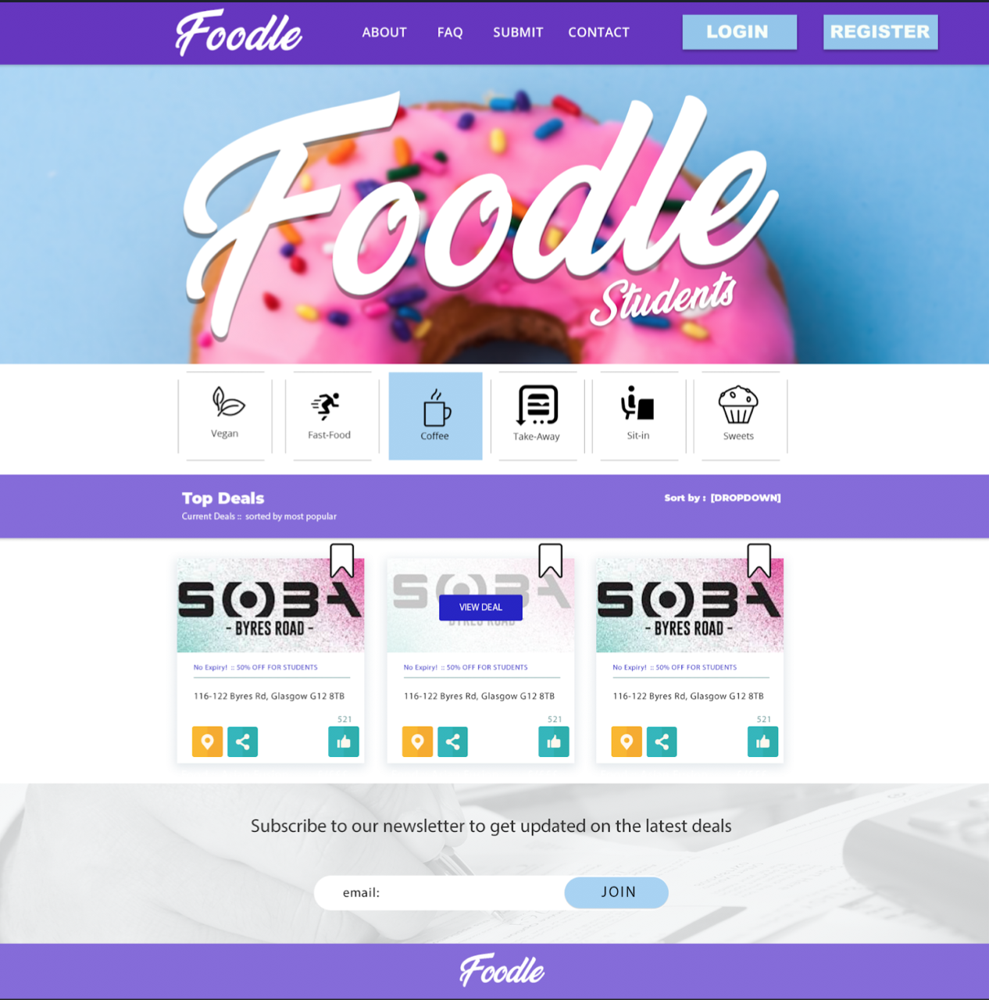

# Foodle
> A responsive web application for finding deals within walking distance built using Django and Angular. 


Intro Paragraph



# Requirements

* Python 3+ !!
* NPM


Check your python version with

```
python -V
```

# Installation

* angular_django_cors - The Django project and main settings file
* foodle - An app within the project, containing the Django Rest Framework views and URL routing
* static/ng-demo - The Angular app source code lives here
* static/dist - The compiled Angular app is here

## OS X & Linux:

### Setup

Open a terminal at the repo root, and run the following:

### Clone the directory to your local drive

```sh
git clone https://github.com/glasgowm148/Foodle_dev.git
cd foodle
```


#### Set up the virtual environment using virtualenv
```sh
pip3 install virtualenv
virtualenv -p python3.6 name
. name/bin/activate
pip3.6 install -r requirements.txt

```
Note : Add your local env to .gitignore!

##### On Windows

```sh
pip install virtualenv
python -m venv name
name\Scripts\activate
```


#### Configure Angular
```sh
cd foodle/front-end
npm install -g @angular/cli@6
ng update @angular/cli @angular/core
ng build
ng serve
cd ../..
python manage.py runserver
```

##### You should now be able to access the front-end 

127.0.0.1:8000

#### Logging into the app

The database included in this repository contains two users. The following are their usernames and passwords, which you may use for testing:

- admin / admin123
- user1 / example123

#### VSCode

If you're using vscode. Open the command pallet and type 'Shell - install 'code' in command PATH'

Then you can just type

`code .` from within Foodle_dev/ to open the project in vscode

Command Pallet - > Python : Enable Linting 


## Release History

* 0.0.1
    * Work in progress


## Version Control (Git)


Generally, we will create a new git branch for each new feature. This is a good practice because in the future if we further update the branch after some discussions, the pull request will be automatically updated. Let's create a new branch to make a very simple change to amend the readme.md file:

```
git checkout -b myfeature develop
```
After making the relevant additions to build the new features, we will just commit the new changes and checkout to the git develop branch:
```
git add .
git commit -m "myfeature info"
git checkout dev
```

#### Incorporating a finished feature on develop ¶

```
Switched to branch 'dev'
$ git merge --no-ff myfeature
Updating ea1b82a..05e9557
(Summary of changes)
$ git branch -d myfeature
Deleted branch myfeature (was 05e9557).
$ git push origin dev
```


